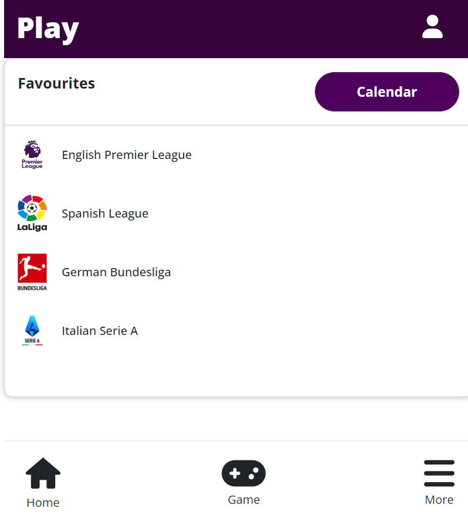
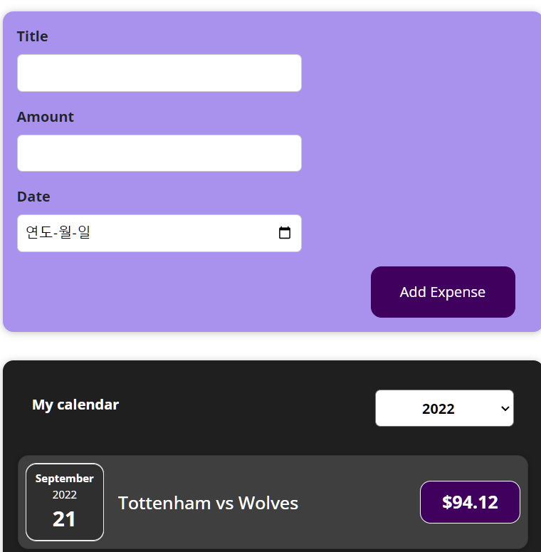
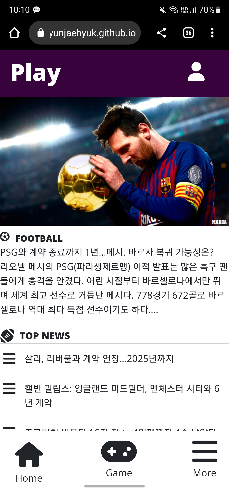
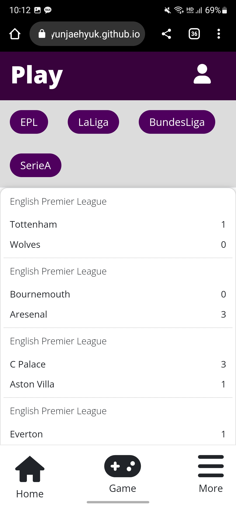
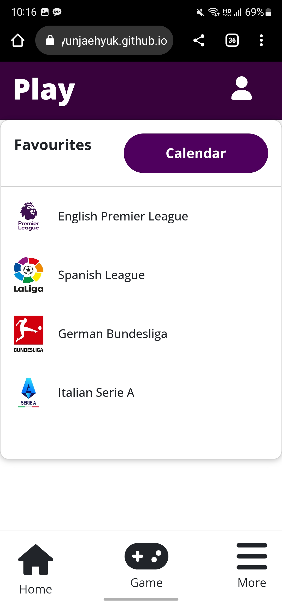

### Introduce

스포츠 플랫폼

Naver 스포츠에서 스포츠 정보를 얻는다는 것에 한계가 있다는 것을 깨달았습니다.

Play 웹페이지는 UI적인 면에서는 사용자들이 편안함을 느끼고 원하는 시간 때 경기시간을 계획하고 사람들이 자신이 필요하는 스포츠 뉴스, 경기, 팀 정보를 확인하는 서비스를 이 웹사이트에서 만들었습니다.

### 배웠던 것

여러 데이터를 렌더링하는 방법을 알게 되었다.

프론트엔드 아키텍처 다층화구조를 이해하고 이를 이용해 컴포넌트 구조를 설계할 수 있다.

조건부 내용 출력하여 원하는 내용을 볼 수 있다.

자식대 부모 통신 컴포넌트의 원리를 알게되어 이를 이해하고 있다.

사용자 입력을 받고 이를 리스닝하여 이를 제출 처리할 수 있다.

입력 정보 유효성 확인하여 로그인, 로그아웃을 할 수 있게 만들었다.

### 어려웠던 점과 이를 위해 노력했던 것

이전에 했던 프로젝트와의 아키텍처와 구성이 달라서 프로젝트를 계획할 떄 이전의 컴포넌트 파일 구조에 대해 생각하고 코딩을 하려고 하니 내 파일의 위치 잊거나 불필요하게 파일 위치를 옮겨야 하는 경우가 생겼다.
그래서 이를 위해 나만의 컴포넌트 분리 방식과 폴더 아키텍처를 만들기로 했다.

<h2>Folder architecture</h2>

   

public -> image 파일 관리

components -> 공통 컴포넌트 관리

layout -> 레이아웃 틀 관리

pages -> 라우터 페이지

store -> redux 관리

UI -> UI 관리

app.js -> 컴포넌트 페이지 관리

index.js -> 컴포넌트의 root

이렇게 폴더의 각 용도 별로 분리하여 폴더 구조를 구성하였다. 규칙 없이 개발한 폴더와 비교했을 떄 작성한 코드의 의도와 위치를 쉽게 알아차릴 수 있었고, 이는 더 나은 개발 퍼포먼스를 이끌었다.

<h3>useEffect를 이용한 Login 페이지</h3>

side Effect를 사용해야할 떄 useEffect를 사용에 대해 왜 사용할까? 언제 사용해야되는 함수일까? 를 고민했다.
그래서 이 고민에 대해 답하기 위해 실제 프로젝트에 login페이지에서 login을 하면 새로고침해도 여전히 인증 상태에 있다는 것을 확실하게 하고 싶었다. useEffect,localStorage를 적용해서 이 앱이 재실행될 때마다 데이터가 유지되었는지를 확인했다.
이는 useEffect가 무언가에 대한 응답으로 실행되는 코드를 다루는데, 어떤 액션에 대한 응답으로 실행되는 액션이 있다면 useEffect가 크게 도움된다는 것을 알게 되었다.

홈페이지

 

메인 뉴스페이지

 

로그인 페이지.

 

로그인과 로그아웃이 가능하다.

 

각 스포츠 리그별 일정이 확인 가능하다.

 

리그 별 순위 표를 확인할 수 있다.

 

 

자신이 원하는 리그 일정을 기록할 수 있다.

 

<h3>모바일에서도 동일한 환경을 구현할 수 있도록 노력하였다.</h3>

 

