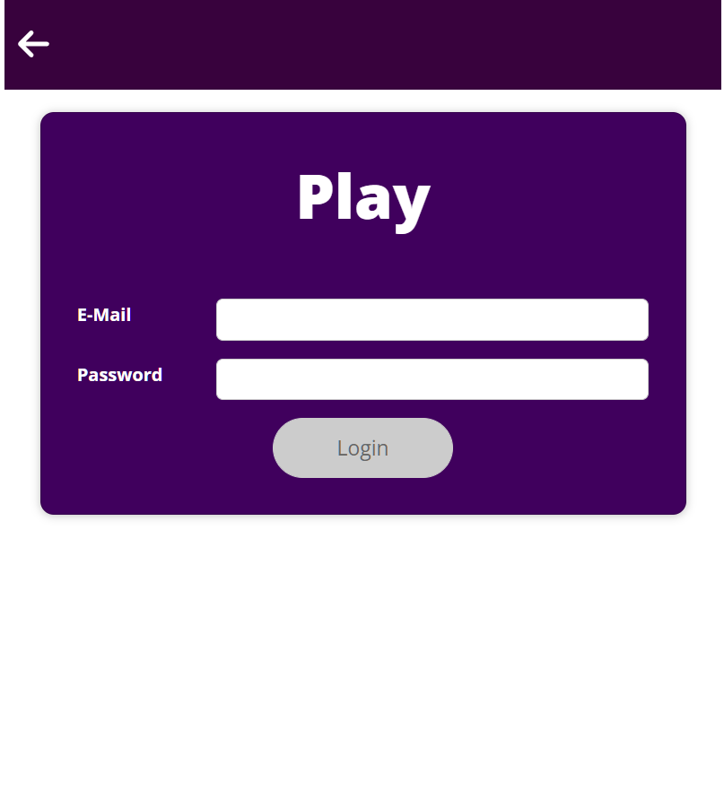
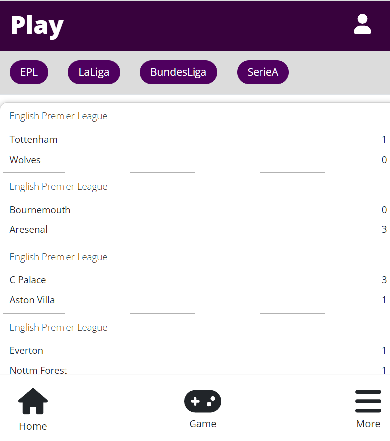

### Introduce

스포츠 플랫폼

사람들이 자신이 필요하는 스포츠 뉴스, 경기, 팀 정보를 확인하는 서비스

### function

사용자는 여러 스포츠 뉴스를 확인 할 수 있다.

축구 4대 리그 스포츠 일정, 순위을 볼 수 있다.

자신의 계획을 캘린더에 적을 수 있다.

로컬 스토리지를 이용한 로그인을 할 수 있다.

### Learned

여러 데이터를 렌더링하는 방법을 알게 되었다.

프론트엔드 아키텍처 다층화구조를 이해하고 이를 이용해 컴포넌트 구조를 설계할 수 있다.

조건부 내용 출력하여 원하는 내용을 볼 수 있다.

자식대 부모 통신 컴포넌트의 원리를 알게되어 이를 이해하고 있다.

사용자 입력을 받고 이를 리스닝하여 이를 제출 처리할 수 있다.

입력 정보 유효성 확인하여 로그인, 로그아웃을 할 수 있게 만들었다.

<figure class="half">

</figure>
<figure class="half">

</figure>
<figure class="half">

</figure>
<figure class="half">

</figure>
