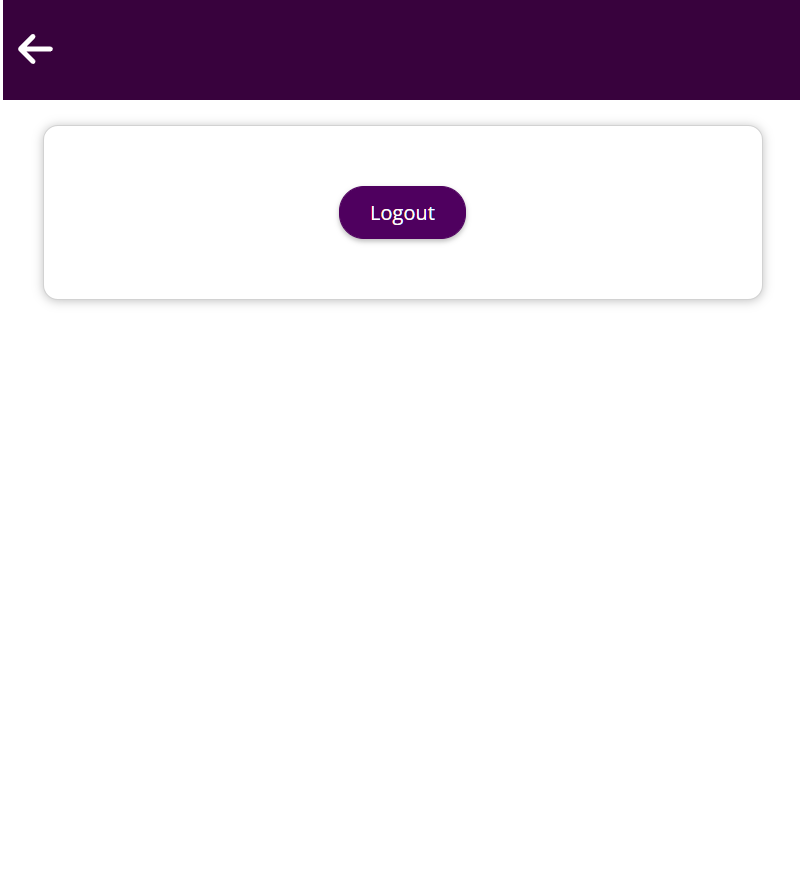
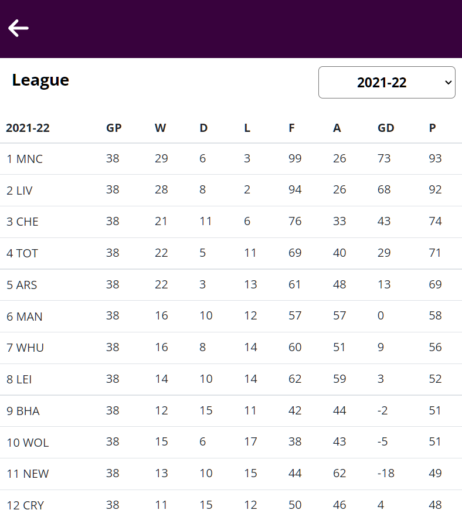

### Introduce

스포츠 플랫폼

Naver 플랫폼에 의하여 스포츠 정보를 얻는다는 것에 한계가 있다는 것을 깨달았습니다.

또한 가짜 정보나 원치 않는 정보는 걸러지고 자신이 원하는 정보만을 얻게되는 사이트가 있었으면 좋겠다고 생각했습니다.

기존에 있던 스포츠 정보 사이트가와는 대조되어 제가 만든 사이트는 UI적인 면에서는 사용자들이 편안함을 느끼고 원하는 시간 때 경기시간을 계획하고 사람들이 자신이 필요하는 스포츠 뉴스, 경기, 팀 정보를 확인하는 서비스를 이 웹사이트에서 만들었습니다.

### 배웠던 것

여러 데이터를 렌더링하는 방법을 알게 되었다.

프론트엔드 아키텍처 다층화구조를 이해하고 이를 이용해 컴포넌트 구조를 설계할 수 있다.

조건부 내용 출력하여 원하는 내용을 볼 수 있다.

자식대 부모 통신 컴포넌트의 원리를 알게되어 이를 이해하고 있다.

사용자 입력을 받고 이를 리스닝하여 이를 제출 처리할 수 있다.

입력 정보 유효성 확인하여 로그인, 로그아웃을 할 수 있게 만들었다.

### 페이지 구성

<figure class="half">

 

메인 뉴스이다.

 
</figure>
<figure class="half">

로그인 페이지.

 

로그인과 로그아웃이 가능하다.

 
</figure>
<figure class="half">

각 스포츠 리그별 일정이 확인 가능하다.

 

리그 별 순위 표를 확인할 수 있다.

 
</figure>
<figure class="half">

 

자신이 원하는 리그 일정을 기록할 수 있다.

</figure>
